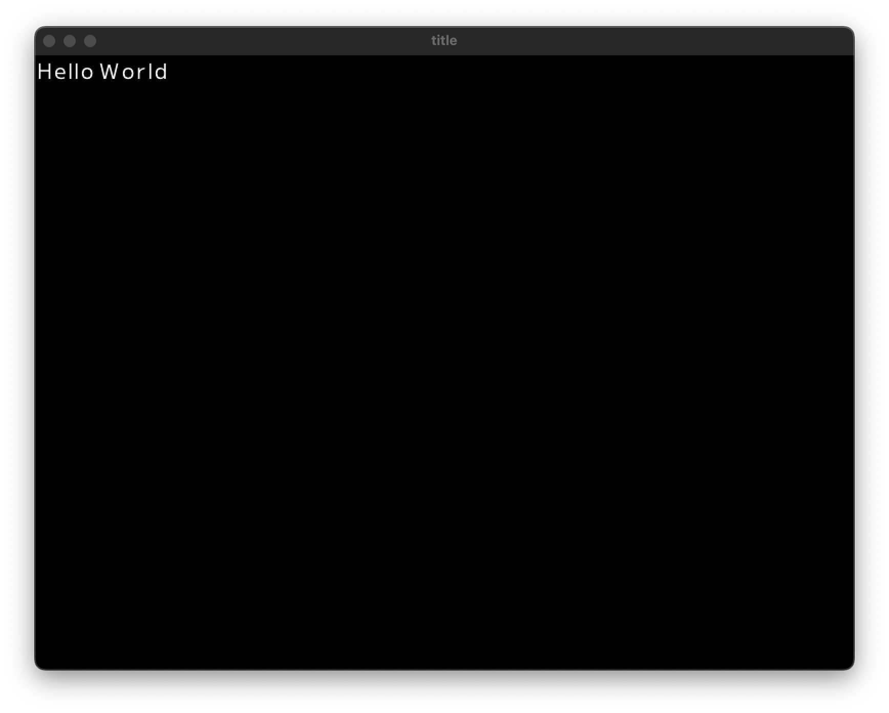

# HelloWorld

最初にHelloWorldを表示するプログラムを作ります。

## コンソールに表示する

::: code-group

```js [ES5]
var Raia = require('raia');
var core = new Raia.Core();
core.print("Hello World");
```

```js [ES6]
var {Core} = require('raia');
var core = new Core();
core.print("Hello World");
```

:::

```
Hello World
```

### print()

コンソールに文字列を表示する関数です。引数に渡された文字列を表示します。

```js
print(str)
```

## ウィンドウに表示する

::: code-group

```js [ES5]
var Raia = require('raia');
var window = new Raia.Window("title", 800, 600);
var font = new Raia.Font("Mplus1-Regular.ttf", 30);
window.setCurrentColor(255, 255, 255);
window.drawString(font, "Hello World", 30);
window.onUpdate(function () {
    window.redraw();
});
```

```js [ES6]
var {Window, Font} = require('raia');
var window = new Window("title", 800, 600);
var font = new Font("Mplus1-Regular.ttf", 30);
window.setCurrentColor(255,255,255);
window.drawString(font, "Hello World", 30);
window.onUpdate(()=>{
    window.redraw();
});
```

:::

### drawString()

ウィンドウに文字列を描画する関数です。第一引数にはFontのインスタンスを指定します。第二引数に文字列、第三引数に文字の大きさを指定します。

```js
drawString(font, str, size)
```

### スクリーンショット

