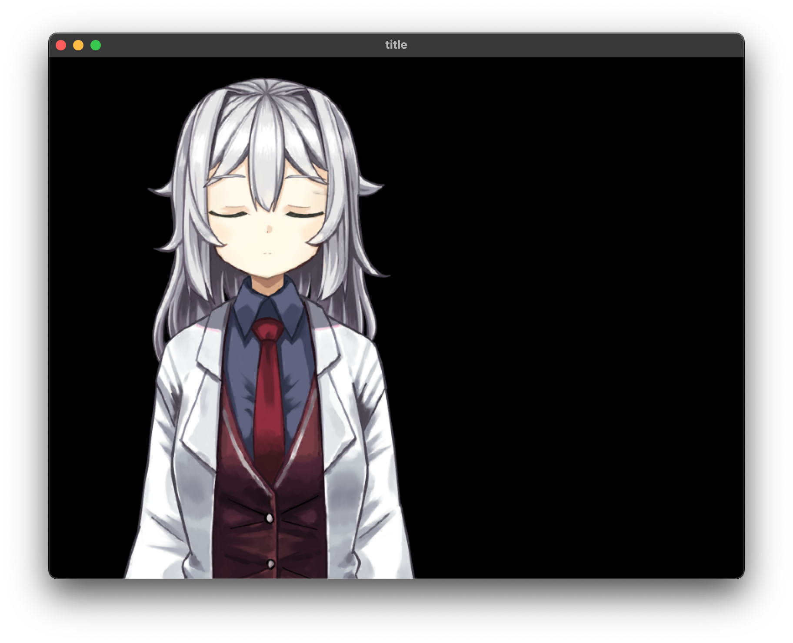

# 画像を表示する

画像を読み込んでウィンドウに描画します。

## 画像を読み込んで表示する

::: code-group

```js [ES5]
var Raia = require('raia');
var window = new Raia.Window("title", 800, 600);
window.loadImage("fore.png");
window.onUpdate(function () {
    window.redraw();
});
```

```js [ES6]
var {Window} = require('raia');
var window = new Window("title", 800, 600);
window.loadImage("fore.png");
window.onUpdate(()=>{
    window.redraw();
});
```

:::

### loadImage()

画像をウィンドウに読み込みます。第一引数にファイル名を指定します。

```js
loadImage(filename)
```

::: warning

現在のバージョンではpng形式のみ対応しています。

:::

### スクリーンショット

