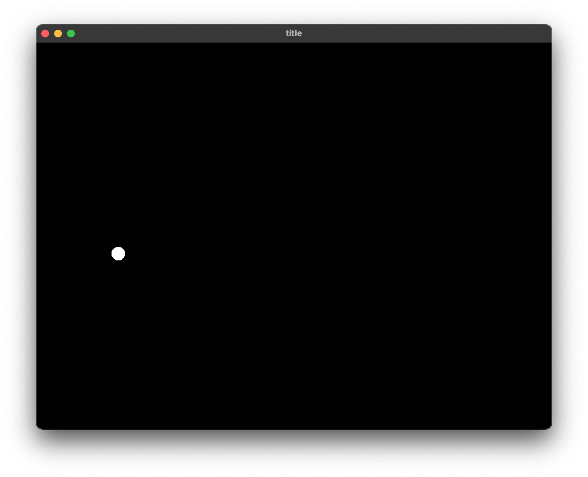

# メインループを使う

## 図形を動かす

::: code-group

```js [ES5]
var Raia = require('raia');
var window = new Raia.Window("title", 800, 600);
var x = 0;
var y = 0;
window.onUpdate(function () {
    window.setCurrentColor(0, 0, 0);
    window.drawFilledRect(0, 0, 800, 600);
    window.setCurrentColor(255, 255, 255);
    window.drawFilledEllipse(x, y, x + 20, y + 20);
    x++;
    y++;
    if (x > 800) {
        x = 0;
    }
    if (y > 600) {
        y = 0;
    }
    window.redraw();
});
```

```js [ES6]
var {Window} = require('raia');
var window = new Window("title", 800, 600);
var x = 0;
var y = 0;
window.onUpdate(()=>{
    window.setCurrentColor(0, 0, 0);
    window.drawFilledRect(0,0,800,600);
    window.setCurrentColor(255,255,255);
    window.drawFilledEllipse(x, y, x + 20, y + 20);
    x++;
    y++;
    if (x > 800) {
        x = 0;
    }
    if (y > 600) {
        y = 0;
    }
    window.redraw();
});
```

:::

### onUpdate()

ゲームのメインループとなる関数です。第一引数に処理を記述した無名関数を指定します。onUpdate関数は繰り返し実行されます。


## フレームレートを調整する

::: code-group

```js [ES5]
var Raia = require('raia');
var window = new Raia.Window("title", 800, 600);
var x = 0;
var y = 0;
window.setFPS(30.0);
window.onUpdate(function () {
    window.setCurrentColor(0, 0, 0);
    window.drawFilledRect(0, 0, 800, 600);
    window.setCurrentColor(255, 255, 255);
    window.drawFilledEllipse(x, y, x + 20, y + 20);
    x++;
    y++;
    if (x > 800) {
        x = 0;
    }
    if (y > 600) {
        y = 0;
    }
    window.redraw();
});
```

```js [ES6]
var {Window} = require('raia');
var window = new Window("title", 800, 600);
var x = 0;
var y = 0;
window.setFPS(30.0);
window.onUpdate(()=>{
    window.setCurrentColor(0, 0, 0);
    window.drawFilledRect(0,0,800,600);
    window.setCurrentColor(255,255,255);
    window.drawFilledEllipse(x, y, x + 20, y + 20);
    x++;
    y++;
    if (x > 800) {
        x = 0;
    }
    if (y > 600) {
        y = 0;
    }
    window.redraw();
});
```

:::

### setFPS()

onUpdate関数のフレームレートを第一引数に設定します。デフォルトでは60が設定されています。

```js
setFPS(val)
```

### スクリーンショット

