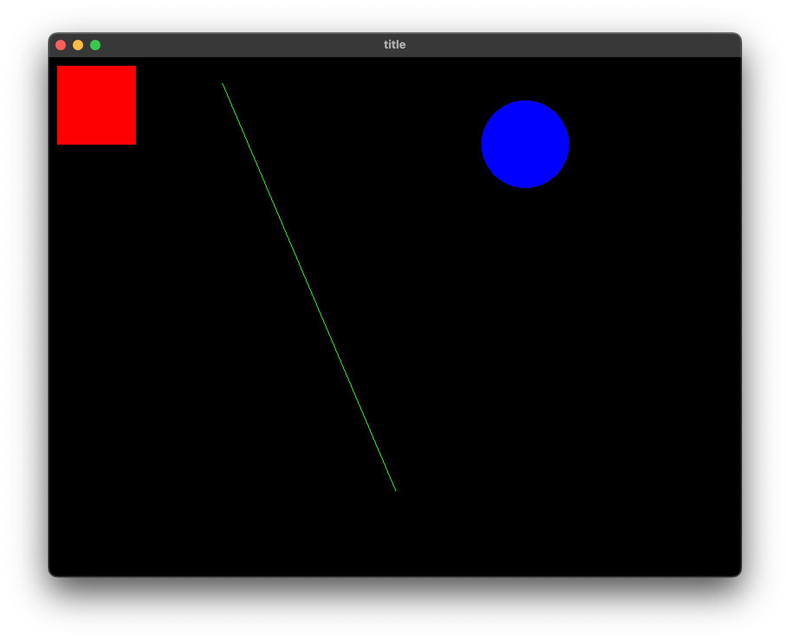

# 図形の描画

ウィンドウに基本となる図形を描画します。

## 色々な図形を描く

::: code-group

```js [ES5]
var Raia = require('raia');
var window = new Raia.Window("title", 800, 600);
window.setCurrentColor(255, 0, 0);
window.drawFilledRect(10, 10, 100, 100);
window.setCurrentColor(0, 255, 0);
window.drawLine(200, 30, 400, 500);
window.setCurrentColor(0, 0, 255);
window.drawFilledEllipse(500, 50, 600, 150);
window.onUpdate(function () {
    window.redraw();
});
```

```js [ES6]
var {Window} = require('raia');
var window = new Window("title", 800, 600);
window.setCurrentColor(255, 0, 0);
window.drawFilledRect(10,10,100,100);
window.setCurrentColor(0,255,0);
window.drawLine(200, 30, 400, 500);
window.setCurrentColor(0,0,255);
window.drawFilledEllipse(500, 50, 600, 150);
window.onUpdate(()=>{
    window.redraw();
});
```

:::

### setCurrentColor()

Windowオブジェクトの現在の色を設定します。引数redが赤、greenが緑、blueが青、alphaが透明度を表し、それぞれ0から255までの整数で指定します。

```js
setCurrentColor(red, green, blue, alpha)
```

::: info

Windowオブジェクトは現在の色を保持しています。現在の色は図形の描画などに使われます。

:::

### drawLine()

ウィンドウに直線を描きます。引数x1, y1に描き始めの座標を指定し、引数x2, y2に終端の座標を指定します。

```js
drawLine(x1, y1, x2, y2)
```

::: info

drawLine関数は実際には第9まで引数がありますが、ここでは省略します。続く関数も同様です。

:::

### drawFilledRect()

ウィンドウに塗りつぶした矩形を描画します。引数x1, y1に矩形の最初の座標を指定し、引数x2, y2に終端の座標を指定します。

```js
drawFilledRect(x1, y1, x2, y2)
```

### drawFilledEllipse()

ウィンドウに塗りつぶした円を描画します。引数x1, y1の座標から引数x2, y2の座標を指定します。指定した座標の矩形に収まる円（または楕円）を描画します。

```js
drawFilledEllipse(x1, y1, x2, y2)
```

### スクリーンショット

